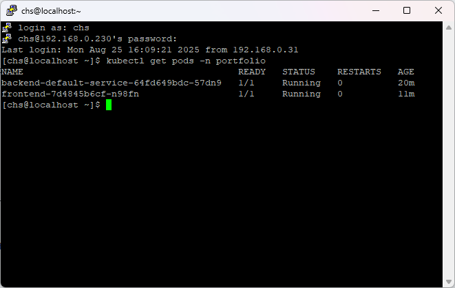

# 📝[now2woy 개인 포트폴리오 프로젝트]

## 🚀 프로젝트 개요
이 프로젝트는 개인 포트폴리오 웹 애플리케이션으로, React, Next, SpringBoot, CI/CCD 연습을 목표로 합니다.

- **배포 링크** : <a href="https://now2woy.duckdns.org" target="_blank">now2woy's Portfolio</a>
- **ID / PW** : guest001@gmail.com / guest001

 

---

## 💻 기술 스택

### **Frontend**
- **Framework** : React 18, Next.js 15
- **State Management** : Zustand
- **Styling** : Tailwind CSS 4.1, shadcn/ui
- **Data Fetching** : React-Query, Axios
- **Language** : TypeScript, JavaScript
- **Bundler** : Webpack
- **Deployment** : Jenkins, Docker

### **Backend**
- **Framework** : SpringBoot 3.5.3
- **Database** : PostgreSQL
- **ORM/ODM** : JPA, Mybatis
- **Authentication** : JWT
- **Language** : Java 21
- **Deployment** : Jenkins, Docker

### **CI / CD & Infra**
- **OS** : Rocky Linux  
- **Automation Server** : Jenkins  
- **Containerization** : Docker  
- **Orchestration** : Kubernetes(k3s, Rancher에서 제공하는 경량 배포판)  
- **Pipeline** : Build → Push(Local Registry) → Deploy(Kubernetes k3s)  

 

---

## 🛠️ 주요 기술 및 활용

### **Frontend**
-   **상태 관리 (Zustand)**
    -   애플리케이션 전반에 걸쳐 사용되는 **다크 모드/라이트 모드** 토글과 같은 전역 상태를 관리하는 데 활용했습니다.

-   **데이터 통신 & 관리 (Axios, React-Query)**
    -   **Axios**: 모든 API 통신을 위한 HTTP 클라이언트 라이브러리로 사용했습니다.
    -   **React-Query**: 서버 상태 관리를 위해 도입했으며, 데이터 조회 및 갱신 시 캐싱, 데이터 동기화, 비동기 처리를 효율적으로 관리했습니다.
        -   **`useQuery` & `Prefetching`**: 목록 형태의 데이터를 조회할 때 `useQuery`를 사용하고, 사용자 경험 개선을 위해 목록 페이지에 진입하기 전에 다음 페이지 데이터를 미리 가져오는 **프리패칭(Prefetching)**을 적용했습니다.
        -   **`useMutation`**: 저장, 수정, 삭제와 같은 데이터 변경 로직에 `useMutation`을 사용하여 서버 데이터 업데이트를 간편하게 처리하고, 성공 시 관련 쿼리 데이터를 자동으로 무효화(invalidate)하여 최신 상태를 유지하도록 했습니다.

 

### **Backend**
-   **데이터베이스 접근 기술 (JPA, MyBatis)**
    -   **JPA**: 대부분의 CRUD(Create, Read, Update, Delete) 작업을 처리하며 엔티티와 테이블 간의 매핑을 자동화하는 데 사용했습니다.
    -   **MyBatis**: 복잡하거나 동적인 쿼리가 필요한 경우에는 XML 기반의 매퍼(Mapper) 파일을 활용하는 MyBatis를 함께 사용하여 유연성을 확보했습니다.

-   **인증/인가 (Spring Security & JWT)**
    -   **Spring Security**: 애플리케이션의 보안을 담당하며, 사용자 인증 및 인가를 처리하는 데 활용했습니다.
    -   **JWT(JSON Web Token)**: 토큰 기반의 무상태(stateless) 인증 방식을 구현하여, 서버에 세션을 유지하지 않고도 사용자 인증을 효율적으로 관리했습니다.

-   **API 통신**:
    -   모든 클라이언트-서버 간 통신은 **RESTful API**를 통해 이루어지도록 설계하여, 각 엔드포인트가 자원(Resource)에 대한 CRUD 연산을 명확히 표현하도록 했습니다.

 

### **CI / CD & Deployment**

#### CI/CD 파이프라인 (Jenkins + Kubernetes)
- Jenkins를 통해 전체 배포 과정을 자동화했으며, 민감한 정보는 Jenkins Credentials로 안전하게 관리.  

**주요 단계**
1. **소스코드 Checkout**  
   - GitHub에 새로운 코드가 푸시되면 Jenkins가 주기적으로 감지 후 최신 코드 가져오기.  
2. **빌드**  
   - 백엔드(`apps/backend-default-service`) → `./gradlew build`로 JAR 생성.  
   - 프론트엔드(`apps/frontend`) → `npm run build` 실행. (환경 변수는 Jenkins Credential 주입)  
3. **Docker 이미지 빌드 & 푸시**  
   - 각 프로젝트의 Dockerfile 기반으로 이미지 빌드 후 로컬 Registry에 푸시.  
4. **배포(Kubernetes k3s)**  
   - 기존에는 Nginx를 설치하고 빌드된 정적 파일을 Nginx가 서비스하는 디렉토리로 복사했지만, 현재는 **프론트엔드가 직접 정적 파일을 처리**하도록 변경했습니다.  
   - 기존 Nginx에서 제공하던 SSL 및 리버스 프록시 기능은 **Traefik으로 대체**하여, SSL 적용과 라우팅을 담당하도록 구성했습니다.  
   - 기존 도커 컴포즈에서 컨테이너를 재기동하던 방식은 **Kubernetes(k3s)의 롤링 업데이트** 방식으로 대체하여, 무중단 배포가 가능하도록 구현했습니다.

 

---

## 📸 주요 화면

### [로그인 화면]

- 사이트 링크 : <a href="https://now2woy.duckdns.org" target="_blank">now2woy's Portfolio</a>
- ID : guest001@gmail.com
- PW : guest001
 
 

### [메인 화면]

- 선 차트, 바 차트, 파이 차트 적용
 
 

### [메인 화면 다크 모드]

- 우측 상단 버튼을 클릭하면 라이트 / 다크 모드 토글이 가능
 
 

### [목록 화면]

 
 

### [입력 / 수정 화면]

- Tiptap 에디터 적용
 
 

### [행추가, 행삭제 입력 / 수정 화면]

- 하단 테이블 행추가, 행삭제 가능
- 하단 테이블 앞 부분 단추를 드래그 & 드랍하여 행 순서 변경 가능
 
 

### [젠킨스 프론트엔드 빌드 결과 화면]

- 빌드 시 git의 커밋 값을 이용해 이미지를 태그하고 latest도 태그하여 이미지 저장
- 마지막 이미지를 이용하여 무중단 재기동
 
 

### [젠킨스 백엔드 빌드 결과 화면]

- 빌드 시 git의 커밋 값을 이용해 이미지를 태그하고 latest도 태그하여 이미지 저장
- 마지막 이미지를 이용하여 무중단 재기동
 
 

### [Kubernetes k3s pod 확인 화면]

- 현재 구동 중인 pod의 구동시간을 확인하여 정상적으로 디플로이 됐는지 확인
 
 

### [Kubernetes k3s 프론트엔드 설정 파일]

- 프론트엔드의 디플로이 설정 파일
 
 

### [Kubernetes k3s 백엔드 설정 파일]

- 백엔드의 디플로이 설정 파일
 

---

